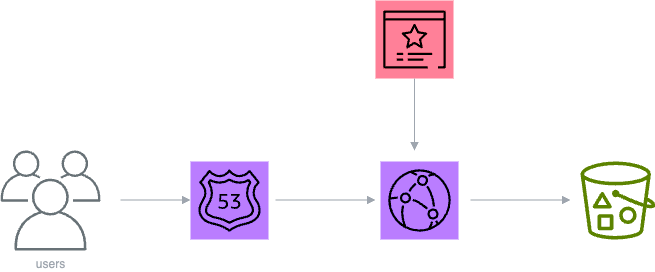

# Infrastructure for the S3 Static Website Hosting

## Architecture

## Providers

| Name | Version |
|------|---------|
|  [aws](#provider\_aws) | 5.44.0 |

## Inputs

| Name | Description | Type | Default | Required |
|------|-------------|------|---------|:--------:|
|  [aws\_account\_id](#input\_aws\_account\_id) | AWS Account ID where S3 is hosting | `string` | n/a | yes |
|  [aws\_region](#input\_aws\_region) | n/a | `string` | `"us-east-1"` | no |
|  [bucket\_name](#input\_bucket\_name) | Name for the S3 bucket | `string` | n/a | yes |
|  [domain\_name](#input\_domain\_name) | Domain name for the website | `string` | n/a | yes |
|  [route53\_zone\_id](#input\_route53\_zone\_id) | Zone ID of Route 53 hosted zone | `string` | n/a | yes |
|  [subject\_alternative\_names](#input\_subject\_alternative\_names) | Subject alternative names for the certificate | `list(string)` | n/a | yes |

## Outputs

| Name | Description |
|------|-------------|
|  [cloudfront\_distribution\_domain\_name](#output\_cloudfront\_distribution\_domain\_name) | n/a |
|  [dns\_name](#output\_dns\_name) | n/a |